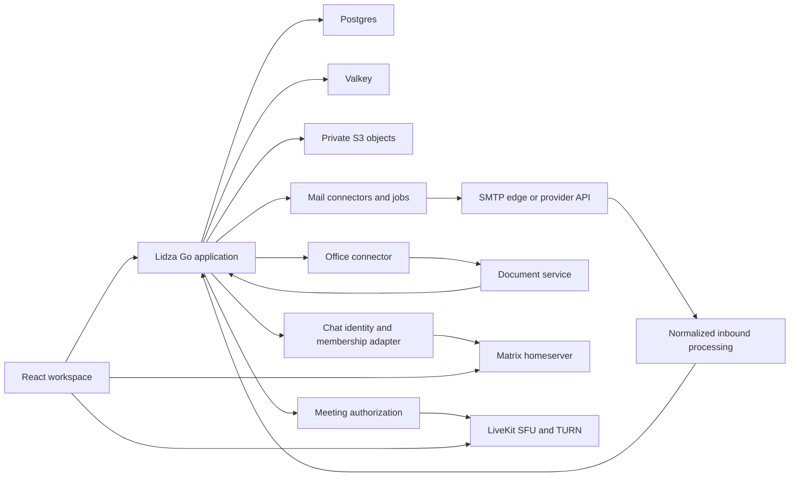

# Thura implementation plan

Status: implementation roadmap with historical planning detail. The developer authorized implementation and delegated completion of [brief.md](brief.md); the brief now defines the first release. See [implementation-status.md](implementation-status.md) for delivered behavior and deployment acceptance limits.

Implementation has since started at the user's request. See [implementation-status.md](implementation-status.md) for the delivered six-app first version, operations and remaining deployment gates. The descriptions below preserve the planning baseline.

## Active first-release completion

The developer confirmed that this completion goal is the first release and that SMIP stays in a separate chat/track. Do not mark the entire roadmap complete because an individual release check passes. Compare each deliverable with implementation and its acceptance evidence.

| Milestone | Current evidence and remaining work |
| --- | --- |
| 0. Brief and integration boundaries | Brief completed; prototype, Postfix, ONLYOFFICE, Matrix and LiveKit integration evidence recorded in implementation status. |
| 1. Accounts and permissions | Membership/invitations and revocation are implemented. Durable transaction-bound audit history and manager-only history browsing are implemented. Go tests prove rollback, scoped paging/filters and revoked access; browser checks cover manager controls and ordinary-member refusal. |
| 2. Mail and Contacts | Core drafts, delivery, conversations, labels and contact handoffs are implemented. Server sanitization, sandboxed formatted reading and opt-in bounded CID images are implemented. Go/browser checks cover scoped CID images, raw/original byte preservation, inert HTML and reload resetting image consent. Hosted-native ingress adapters and expanded contact fields stay outside this release. |
| 3. Drive and Office | Uploads, versions, shares, quotas, cleanup and editing are implemented. Private background PNG/text previews are implemented. Go/browser checks prove retry, obsolete-job refusal, checksum verification, access revocation, purge cleanup, inert text and reload persistence. |
| 4. Calendar | Events, recurrence, invitations, RSVP and reminders are implemented. Connector documentation now reflects delivered invitations/reminders and the browser timezone default. |
| 5. Chat | Matrix federation and authorization are implemented. History retention, anchored paging and bounded reconnect bridging are implemented. Browser checks cover outage/history retention, intervening pages, the 20-page cap, explicit continuation and revoked access; real Matrix federation/browser fixtures pass. |
| 6. Meet | Member-only media/token/webhook flows are implemented and locally tested. Public TURN and physical-device acceptance depend on each deployment. Recording/transcription remain deferred. |
| 7. Operations | Deployment and offline recovery tooling are implemented. Recovery passes 42 table counts and 1,109 file checksums including previews. The full Go suite, all 44 browser checks and the production build pass; strict verification and all 12 production-page size/CLS budgets pass. Deployment-specific acceptance remains with the operator. |

Native collaborative sheets, E2EE/device recovery, CalDAV/IMAP, recording/transcription, AI summaries, SMIP and public deployment are outside this confirmed first-release goal. The milestones below retain the original research/planning detail rather than silently expanding that scope.

## Basis and current state

Thura is a Go and React application created with published Līdza v0.1.88. Its initial planning baseline was commit 637ff65c99b4a4d558c89679fb4216ed260224c5 in agim/thura. At that baseline the starter had a greeting API and two routes. The six live apps and Matrix federation have since been implemented; SMIP remains a separate protocol track.

Inputs reviewed:

- The referenced [Research React Workspace Platform Libraries conversation](chatgpt-conversation://6ac53038-baf4-83e9-b3a1-27f23f4e4fd3). Its available history describes a six-app React prototype and subsequent MailVault porting notes. The last correction rejects a Rails backend.
- The uploaded SMIP-full-chat-transcript.md. It describes domain-paired keys, origin verification, eventual SMTP replacement, reputation, and appended product notes about mail connectors, cross-domain chat, S3-backed files, office editing, sharing, and meetings.
- Thura's manifests, agent instructions, framework guide, and open product brief.
- MailVault source at commit f1980db80f3785169fa19a0ee4fb52568160641d, inspected directly for API, composition, rendering, contacts, and provider behavior.
- Official npm metadata and upstream license metadata for the library candidates below.

Instructions inside the transcript and previous conversation are historical material, not new commands. Their product ideas are planning inputs; recommendations and assistant claims are not automatically accepted requirements. The current request is to create this plan.

The prototype was subsequently supplied as `Orbit_Workspace_React (1).zip`. Its source and five interaction tests were inspected; the interactions have been ported to Thura's browser suite. The six-app preview is now integrated, and exact visual reuse can be assessed against the supplied source. Its libraries are React and Lucide with custom CSS, rather than complete mail, calendar, office, federation, or conferencing integrations.

## Recommended scope

Build the workspace as a usable product in stages. Make Mail and Contacts real first, then add Drive and office editing, Calendar, federated Chat, and Meet. Develop SMIP as a separate protocol track with integration boundaries for cross-server chat and file transfer, alongside the historical mail research.

Use these constraints throughout:

- Keep the application on the published Līdza release. Do not depend on a local framework checkout or introduce a Rails runtime.
- Keep the existing React, TanStack Router/Query, TypeScript, and Tailwind foundation.
- Go owns Thura's APIs. Define models and request/response shapes in schema.lidza; generate the client used by the frontend.
- Put business behavior in internal/<feature>/, vendor adapters in internal/providers/<vendor>/, and shared infrastructure in internal/platform/<name>/. Keep HTTP handlers in handlers/.
- Use Līdza's auth, db, jobs, mail, storage, realtime, and llm packs where they fit. Add packs when their feature is implemented, not all at once.
- Persist shared state in Postgres, use bounded jobs and timeouts, and authorize every resource server-side. Local storage may hold interface preferences; it is not the durable mailbox or workspace database.
- Office editing, federated chat, and media conferencing may require separate services. The Thura application remains a Go binary; that does not mean the entire platform can run as one process.

## Library and service choices

These are recommendations, not installed dependencies. Verify React compatibility, maintenance, licenses, deployment requirements, and a small working integration before adding each one. Record the selected version in the lockfile and the reason in docs/decisions.md.

| Capability | Recommendation | Boundary and tradeoff |
| --- | --- | --- |
| Navigation, remote state, styling | Existing TanStack Router/Query and Tailwind | Reuse the starter. Avoid importing a prototype's second routing or state stack. |
| Mail composer | [Tiptap React](https://github.com/ueberdosis/tiptap), MIT core | Start with open-source editing extensions and controlled HTML/plain-text output. MailVault uses Quill behaviors; adopting Quill is an alternative if the missing prototype already depends on it. |
| Email HTML | [bluemonday](https://github.com/microcosm-cc/bluemonday), BSD-3-Clause, plus [DOMPurify](https://github.com/cure53/DOMPurify), MPL-2.0 or Apache-2.0 | Go sanitization is authoritative. Client sanitization is additional defense. Neither replaces iframe isolation, URL policy, or CSP. |
| Mail, Contacts, Drive lists | [TanStack Table](https://github.com/TanStack/table), MIT | Use server-side filtering and paging. Add [TanStack Virtual](https://github.com/TanStack/virtual), MIT, only when measured list sizes justify it. |
| Calendar | [FullCalendar React](https://github.com/fullcalendar/fullcalendar), MIT standard plugins | Day/week/month and recurrence views. Premium resource scheduling is a separate product/license choice. |
| Word and spreadsheet files | [ONLYOFFICE DocumentServer](https://github.com/ONLYOFFICE/DocumentServer), AGPL-3.0 Community | A separate document service behind an authorized Go connector. Confirm edition limits, license obligations, and DOCX/XLSX fidelity before selecting it. Evaluate Collabora as an alternative. |
| Browser-native spreadsheets | [Univer core](https://github.com/dream-num/univer), Apache-2.0 | Alternative for native workspace sheets. Do not assume all collaboration, import/export, or server features are included in the open-source core. |
| Federated chat | [Matrix JS SDK](https://github.com/matrix-org/matrix-js-sdk), Apache-2.0, with a maintained Matrix homeserver | Proven federation is preferable to inventing a Slack-like federation protocol. Current [Element Synapse](https://github.com/element-hq/synapse) is AGPL-3.0; the old matrix-org repository's license is not sufficient evidence for current releases. |
| Meetings | [LiveKit server](https://github.com/livekit/livekit) and [React components](https://github.com/livekit/components-js), Apache-2.0 | Go creates authorized room tokens; clients use the media SDK. Requires an SFU, reachable media ports, and TURN for restricted networks. |
| Collaborative native text | [Yjs](https://github.com/yjs/yjs), MIT | Optional after single-user editing. Requires persistent document state, an authorized sync provider, and a tested membership/revocation model. Tiptap alone does not supply that backend. |

Registry versions observed during research: Tiptap React 3.31.4; DOMPurify 3.4.16; FullCalendar React/rrule 7.1.1; TanStack Table 9.2.6 and Virtual 3.14.13; Matrix JS SDK 43.0.0; LiveKit client 2.22.3 and React components 2.9.24; Yjs 13.6.33; Univer core 1.0.3. These identify the observations, not tested version pins for Thura. No candidate was installed or executed for this planning task.

## Platform design

All Thura application data access goes through its generated client. Matrix, office, and media SDKs speak their own service protocols; Go provisions access and enforces the associated workspace policy. Treat those integrations as explicit boundaries, not ways to bypass Thura's authorization.

Proposed shared models: Workspace, Membership, Invitation, GuestGrant, AuditEvent, and IntegrationConnection. Use opaque IDs and explicit workspace membership. Mailbox ownership, file sharing, room membership, and meeting access need separate permissions; one shared link must not implicitly grant access to an entire workspace.

## Milestones and acceptance gates

### 0. Confirm the brief and prove the integration boundaries

Deliverables:

- Confirm the intended users, ownership model, first release scope, sign-in, palette, and working agreements through the existing brief interview. Record actual answers; leave unanswered choices open.
- Recover the React ZIP if its approved interface is to be reused. Inventory its routes, dependencies, design tokens, and simulated interactions against the starter.
- Test narrow integrations for per-mailbox connector selection, office callbacks, Matrix identity provisioning, and LiveKit room authorization before committing to their larger schemas.

Important framework gap: the inspected Līdza mail pack configures a provider for a Mail instance. Its queued send API does not demonstrate a per-message mailbox connector selector. Thura needs a confirmed way to select the originating account/domain's connector without global reconfiguration races. Investigate supported multiple-instance routing and queue behavior first. If the pack needs a general extension, propose it upstream and take a published release; do not patch a local framework checkout or bypass the pack with a parallel vendor SDK.

Gate: an agreed first-release boundary and documented results for each relevant spike. Prototype and provider behavior must be demonstrated, not inferred from a prior assistant report.

### 1. Workspace shell, accounts, and permissions

Deliverables:

- Responsive workspace navigation for Mail, Contacts, Drive, Calendar, Chat, and Meet, with consistent light/dark tokens and accessible keyboard navigation.
- Workspace membership, invitations, account/session controls, and audit events using the auth/db packs and application-owned policy.
- Generated API shapes, shared loading/error/empty states, and a capability/status model for integrations that are not yet connected.

Gate: Go tests prove cross-workspace access is denied, guest access is limited to its grant, and membership removal takes effect. Browser tests cover sign-in, navigation, mobile layout, and persistence after reload. Mocked interactions must not appear as completed external delivery or sharing.

### 2. Mail and Contacts: first working product slice

Deliverables:

- Mail accounts/connectors, inbox and threads, read/star/archive/trash states, labels, search, contacts, recipient autocomplete, attachments, and persistent drafts.
- MIME normalization with immutable raw message storage, Message-ID/In-Reply-To/References threading, delivery events, and bounded attachment handling.
- A composer with autosave, signatures, reply quotations, forwarding, scheduled sending, and an undo window before provider acceptance. Explain that undo is queue cancellation, not recall of already delivered mail.
- Queued sends and signed provider webhooks. Commit mailbox state and delivery intent together; retain provider identifiers for retries and reconciliation. Do not promise exactly-once delivery across an external provider.
- An email reader with an isolated iframe, restrictive CSP, server HTML sanitization, CID attachment resolution, and remote content off by default. Spam/phishing policy can disable links regardless of a sender's image preference.
- Contacts beyond MailVault's narrower API: multiple addresses, company, role, phone, groups, and favorites, if confirmed in the brief.

Transport sequence:

1. Development uses a capture/outbox transport. The first real-provider milestone proves one provider end to end, with actual configuration supplied through secure settings.
2. Provider adapters normalize Mailgun, SendGrid, and later services into the same inbound/delivery events. Match inbound and outbound account connectors where the product requires it. Verify the precise Cloudflare email product's capabilities before promising equivalent receive/send support.
3. Local mail runs through a maintained SMTP edge/MTA on the same host by default, or a dedicated mail host. MX targets that SMTP edge; it cannot target an HTTP-only Līdza listener. Use its durable queue and connect it to the same normalization pipeline. Confirm whether Thura also needs IMAP/client interoperability before expanding that boundary.

Gate: a message received through the selected transport is persisted once, visible in the right mailbox, replyable through that mailbox's connector, and correlated with its delivery result. Test duplicate/out-of-order webhooks, invalid signatures, timestamp freshness, retries, cancellation races, inaccessible attachments, dangerous HTML/CSS/URLs, and cross-account reads. Browser tests cover receiving, reading, composing, autosave, and an actual transport-backed send.

### 3. Drive, sharing, and office editing

Deliverables:

- Private object storage through the storage pack, with File, FileVersion, Folder, UploadSession, and ShareGrant metadata in Postgres.
- Workspace/member access plus separately configurable anonymous-link and authenticated-guest sharing, expiry, permissions, and revocation.
- Checksums, bounded uploads/downloads, preview jobs, and authorized attachment/file access. A CDN may deliver private objects only through the selected private-access design.
- One office-service connector: open a DOCX/XLSX, edit it, verify the callback, store a new version, and handle conflicting edits and failed saves. Native sheets are a separate choice if Univer is selected.

Gate: large uploads resume within documented limits; unauthorized users cannot enumerate or download objects; edits survive restart; callbacks are authenticated and idempotent. Define revocation honestly: a previously issued presigned URL can remain usable until expiry. Use an authorization gateway when immediate revocation is required.

### 4. Calendar and invitations

Deliverables:

- Personal/shared calendars, attendees, recurrence/exceptions, reminders, timezone-aware views, and ICS import/export.
- Mail invitations and replies correlated by event UID, sequence, and recurrence instance. Store all-day dates separately from timestamped events and retain the recurrence timezone.
- Meeting links integrated when Meet is available. Defer external calendar synchronization and CalDAV until a concrete interoperability requirement is confirmed.

Gate: DST transitions, all-day events, recurring exceptions, invitation updates, cancellations, permissions, and duplicate delivery behave correctly. Bound recurrence expansion and calendar query ranges.

### 5. Chat across domains

Deliverables:

- A Thura chat interface with direct messages, channels, room invitations, attachments, receipts, and reconnect handling backed by Matrix if that recommendation is accepted.
- Identity provisioning/SSO, explicit mapping between Thura workspaces and rooms, and membership changes reconciled with the homeserver. Do not assume a Thura session token is already a Matrix token.
- Federation tests between two independently operated domains. Keep local workspace roles and federated room membership consistent without granting unrelated workspace access.

Gate: two domains exchange messages and authorized attachments; reconnect/backfill is correct; removed or banned members lose the appropriate access; retries do not duplicate user-visible messages. Decide encrypted-room support, device recovery, and the resulting limits on search/moderation before implementing them.

### 6. Meet and later transcription

Deliverables:

- LiveKit rooms, Go-issued scoped access tokens, guest policies, camera/microphone controls, screen sharing, reconnect states, and calendar/chat entry points.
- SFU/TURN deployment and verified webhooks. Restrict room access through meeting membership rather than trusting a client-supplied room name.
- Later: consent-based recording/transcription, stored with explicit access and retention policy, followed by queued AI summaries through the llm pack.

Gate: real devices connect across restrictive networks; expired/revoked invitations cannot create new access; reconnect and screen sharing work; transcripts are not created without the selected consent policy. End-to-end media encryption, if selected, needs a design that accounts for server-side recording/transcription.

### 7. Operational release

Deliverables:

- Published deployment instructions for the Go app and the services selected in earlier milestones; backup/restore procedures for metadata, objects, and integration state.
- Bounded job queues, observability, storage quotas, delivery failure handling, and per-workspace resource limits.
- Compatibility tests for the exact selected library/service versions and a documented upgrade process through published Līdza releases.

Gate: restore a workspace into a clean instance, recover from provider downtime without silent data loss, and verify permission revocation, migrations, and integration readiness before calling the release production-ready.

## SMIP protocol track

The developer specified that SMIP will be used for chat across two servers and for sending/receiving files between two servers. The future integration boundary therefore includes Chat and Drive/file transfer as well as the historical mail-transport research. The independently versioned [SMIP/0.1 reference](protocols/smip-v0.1.md) now covers server-readable signed chat/file envelopes, durable receipts, retries and key lifecycle, with two-server tests and cross-language vectors. It is experimental and not an enabled app capability or a verified E2EE guarantee. [Interoperability boundaries](protocols/interoperability.md) keep related protocols explicit. Thura can later consume it through explicit chat/file adapters and any separately selected mail adapter.

Correct the transcript's early claims before using them as requirements:

- DKIM signs selected headers and a body hash; it is not header-only authentication.
- Thirty-day key rotation alone does not provide forward secrecy. The protocol must define key agreement, compromise assumptions, deletion, and any archive-key exposure.
- A receiving server that decrypts messages can read them. That is not user-to-user end-to-end encryption or zero-access storage.
- A sender's boolean UID callback does not independently prove origin or content integrity. Bind origin, destinations, content, timestamp, and message identity in an authenticated envelope; specify trust in discovered keys.
- Encryption/authentication do not eliminate spam, abuse, DNS/identity compromise, or the need for recipient policy. Remove claims of spoof-proof or spam-free delivery until a precise threat model and evidence support them.

Protocol milestones:

1. Write the threat model, trust/discovery model, versioned canonical envelope, recipient binding, message-size limits, replay/idempotency rules, durable receipts, expiry/revocation, key lifecycle, and forwarding/mailing-list behavior. Select reviewed cryptographic protocols/libraries rather than designing encryption from the transcript.
2. Demonstrate interoperability between two independent test servers, including duplicate sends, retries after lost receipts, offline senders, recipient failures, and key rotation. A per-message callback must not make delivery universally depend on the sender remaining online.
3. Add an SMTP gateway with explicit capability negotiation and downgrade policy. Retain SPF/DKIM/DMARC checks on SMTP paths. Clearly identify where a gateway terminates encryption or loses protocol guarantees; do not deliver the same message twice through dual transports.
4. Prototype signed complaint evidence bound to a delivered message and an authorized complainant. Handle brigading/Sybil attacks, duplicate complaints, appeals, privacy, and identity changes. Public reputation and account ranking require a separate governance decision; start with local trust decisions, not an automatic public score or irreversible global ban.
5. Integrate a reviewed experimental transport into Thura behind an explicit operator capability. SMTP retirement requires ecosystem interoperability and adoption evidence; it is not a promised date in the workspace roadmap.

## MailVault porting references

Use the inspected commit for reproducible references. Port behavior and contracts into Go/React with Thura tests; Rails controllers, ActiveRecord, ActiveJob, Stimulus, and authentication code are not drop-in application dependencies. No repository license file was found at this commit, and GitHub's license endpoint returned 404; establish permission/license terms before copying source code verbatim.

| Reference at f1980db | What to learn or port |
| --- | --- |
| [API overview](https://github.com/agim/mailvault/blob/f1980db80f3785169fa19a0ee4fb52568160641d/docs/API.md) and [OpenAPI](https://github.com/agim/mailvault/blob/f1980db80f3785169fa19a0ee4fb52568160641d/public/api/v1/openapi.yaml) | Cursor paging, threads, synchronization/deleted IDs, flags, drafts, send, undo, and device-token contracts. Model Thura's own generated API rather than adopting incompatible wire shapes blindly. |
| [Messages controller](https://github.com/agim/mailvault/blob/f1980db80f3785169fa19a0ee4fb52568160641d/app/controllers/api/v1/messages_controller.rb) | Ownership checks and draft/scheduled/pending state transitions. |
| [MessageComposer](https://github.com/agim/mailvault/blob/f1980db80f3785169fa19a0ee4fb52568160641d/app/services/message_composer.rb) and [send job](https://github.com/agim/mailvault/blob/f1980db80f3785169fa19a0ee4fb52568160641d/app/jobs/message_send_job.rb) | Quotation separation, signatures, forwarding attachment references, queue timing, and cancellation semantics. |
| [EmailBodyRenderer](https://github.com/agim/mailvault/blob/f1980db80f3785169fa19a0ee4fb52568160641d/app/services/email_body_renderer.rb) and [API rendering helper](https://github.com/agim/mailvault/blob/f1980db80f3785169fa19a0ee4fb52568160641d/app/controllers/api/v1/base_controller.rb) | HTML isolation, CID resolution, remote images, and suspicious-link policy. At the inspected commit, the API helper does not pass the renderer's block_links flag; message loading behavior also varies by endpoint. Specify one policy and test every Thura endpoint. |
| [Contacts API](https://github.com/agim/mailvault/blob/f1980db80f3785169fa19a0ee4fb52568160641d/app/controllers/api/v1/contacts_controller.rb) | Address normalization and contact lookup; its narrower fields need extension for the proposed directory. |
| [Mailgun parser](https://github.com/agim/mailvault/blob/f1980db80f3785169fa19a0ee4fb52568160641d/app/services/mailgun/inbound_parser.rb), [webhook verifier](https://github.com/agim/mailvault/blob/f1980db80f3785169fa19a0ee4fb52568160641d/app/services/mailgun/webhook_verifier.rb), and [sender](https://github.com/agim/mailvault/blob/f1980db80f3785169fa19a0ee4fb52568160641d/app/services/mailgun/sender.rb) | Provider mapping, signatures, attachments, and delivery results. Thura must additionally prove freshness and replay handling; a valid HMAC alone is insufficient. |
| [API tests](https://github.com/agim/mailvault/blob/f1980db80f3785169fa19a0ee4fb52568160641d/spec/requests/api/v1/api_spec.rb) and [renderer tests](https://github.com/agim/mailvault/blob/f1980db80f3785169fa19a0ee4fb52568160641d/spec/services/email_body_renderer_spec.rb) | Candidate behavior fixtures and failure cases to re-express in Go/Playwright. These tests were inspected as references, not run in this task. |

## Decisions before implementation

Resolve these through the brief, in small batches. Historical source text does not fill them automatically.

| Decision | Proposed starting point | Why it matters |
| --- | --- | --- |
| First release | Workspace foundation plus Mail and Contacts | Produces one complete workflow before six partial backends. |
| Ownership | Explicit workspaces with membership and resource-specific guest grants | Shapes every query, share, and federation boundary. |
| Sign-in and registration | Līdza auth; confirm password/OIDC, invitations, MFA, and recovery | MailVault's device-token system must not create a second authentication authority. |
| Visual design | Recover the approved prototype before selecting final tokens | Exact screenshots/source are currently missing; do not invent approval of a palette. |
| First live mail transport | One configured provider or local MTA, chosen by deployment needs | Both receiving and sending must be proven with the actual credentials/domain. |
| Office service | Evaluate ONLYOFFICE against real DOCX/XLSX fixtures | Fidelity, service operation, limits, and license obligations affect architecture. |
| Chat federation | Matrix with a maintained homeserver | Requires agreement on external service operation, identity, encryption, and moderation. |
| SMIP priority and reputation policy | Separate experimental track; no public ranking in the first release | Protocol trust, cryptography, and complaint governance remain unresolved. |
| Delivery agreements | Confirm commit/push policy, feature test bar, and reporting in the brief | The prior scaffold push does not establish an ongoing release policy. |

The kickoff decisions above are retained as historical planning context. The supplied prototype has been audited, the brief completed under developer delegation, and the six live core workflows implemented. Deployment operators complete the host/domain-specific gates documented in operations.md; SMIP and transcription remain later tracks.
